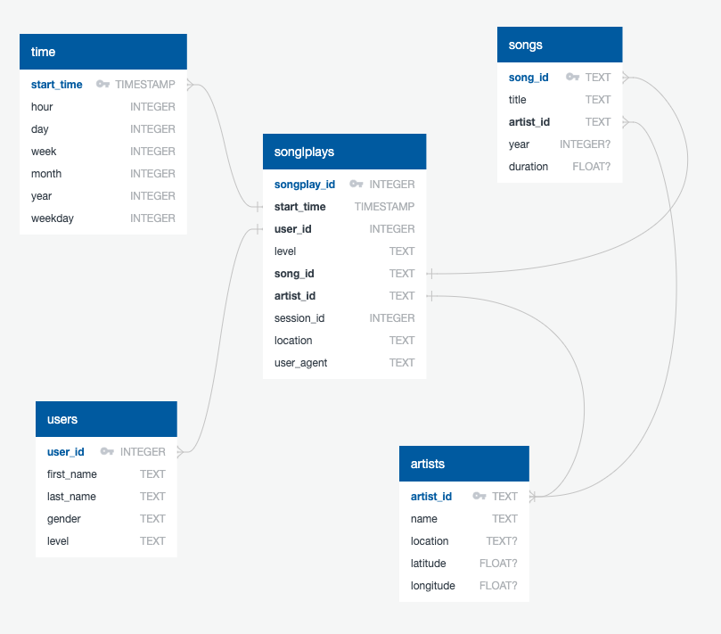
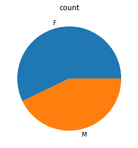
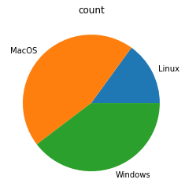
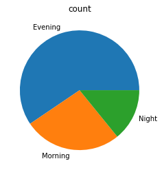
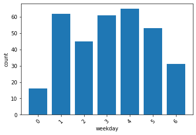

# Project 4: Data Warehouse
This is the code for the fourth project of the [Udacity Data Engineering Nanodegree](https://www.udacity.com/course/data-engineer-nanodegree--nd027).

## Project Overview
### Introduction
A music streaming startup, Sparkify, has grown their user base and song database even more and want to move their data warehouse to a data lake. Their data resides in S3, in a directory of JSON logs on user activity on the app, as well as a directory with JSON metadata on the songs in their app.

We are going to build an ETL pipeline that extracts their data from S3, processes them using Spark, and loads the data back into S3 as a set of dimensional tables in Parquet format. This will allow their analytics team to continue finding insights in what songs their users are listening to.

### Schema Design
We created a star schema optimized for queries on song play analysis using the provided datasets. This includes the following tables.

#### Fact Table
1. **songplays** - records in log data associated with song plays i.e. records with page `NextSong`
    + songplay_id, start_time, user_id, level, song_id, artist_id, session_id, location, user_agent

#### Dimension Tables
1. **users** - users in the app
    + user_id, first_name, last_name, gender, level

2. **songs** - songs in music database
    + song_id, title, artist_id, year, duration

3. **artists** - artists in music database
    + artist_id, name, location, latitude, longitude

4. **time** - timestamps of records in songplays broken down into specific units
    + start_time, hour, day, week, month, year, weekday



### ETL Pipeline
The pipeline loads the song and log datasets in JSON format from S3, processes the data into analytics tables in a star schema using Spark, and writes those tables into partitioned Parquet files back to S3.

## Quickstart
### Project Structure
The project workspace includes these files:

+ `docker-compose.yml` configures a Docker container for running the project.
+ `README.md`

Under `services/jupyter/config/src/`:
+ `etl.py` reads and processes files from `song_data` and `log_data` directories and transforms them into Parquet files.
+ `sql_queries.py` contains all the SQL queries.
+ `dashboard.ipynb` displays a few example queries and results for song play analysis.
+ `dl.cfg` contains the AWS credentials.

Under `services/jupyter/config/config/`:
+ `requirements.txt` contains the Python packages needed for this project.
+ `requirements-all.txt` contains all the Python packages (including the ones provided by the base Docker image) needed for this project.

Under `services/jupyter/config/docker/`:
+ `Dockerfile` creates the Jupyter image we used for this project.

### Project Setup
#### 1. Docker
Make sure you have already installed both Docker Engine and Docker Compose. Everithing else is provided by the Docker images.

From the project directory, start up the application by running `docker-compose up --build -d`. Compose builds an image for the `jupyter` service, starts the container in the background, and leaves it running.

Execute `docker-compose logs -f jupyter` and check the server logs for a URL to connect to the notebook server. Run `docker-compose down` to stop the container.

#### 2. Local Installation
If you already have a Python installation on your system, check the dependencies from `services/jupyter/config/requirements-all.txt` and execute the code under `services/jupyter/config/src/`.

### Running the code
Make sure you created an AWS S3 bucket for storing the output files and have added the right user credentials to access said bucket to `dl.cfg`.

#### 1. Local Mode
Open terminal, `cd` into the `work` directory (or `services/jupyter/config/src/` if you are on a local installation), and run `python etl.py --input_data=s3a://udacity-dend/ --output_data=<your-S3-bucket>`. You can run the same code with a local dataset pointing the `input_data` and `output_data` variables to the directories of your choice.

#### 2. Standalone Mode on EMR
Please refer to the latest [AWS documentation to set up an EMR Cluster with Jupyter Notebooks](https://docs.aws.amazon.com/emr/latest/ManagementGuide/emr-managed-notebooks-working-with.html).

Once your cluster is set up and properly configured, copy the project files to your EMR instance and run `spark-submit etl.py --input_data=s3a://udacity-dend/ --output_data=<your-S3-bucket>`.

## Example Queries and Results
### User Account Level
````
SELECT level, COUNT(*)
FROM users
GROUP BY level
ORDER BY level;
````


### User Gender
````
SELECT gender, COUNT(*)
FROM users
GROUP BY gender
ORDER BY gender;
````



### User Operating System
````
SELECT
    CASE
        WHEN user_agent LIKE '%Linux%' THEN 'Linux'
        WHEN user_agent LIKE '%Mac%' THEN 'MacOS'
        WHEN user_agent LIKE '%Windows%' THEN 'Windows'
        ELSE 'Unknown'
    END AS os,
    COUNT(*)
FROM
    songplays
GROUP BY os
ORDER BY os;
````



### Most Popular Play Times Per Time of Day
````
SELECT
    CASE
        WHEN t.hour BETWEEN 6 AND 12 THEN 'Morning'
        WHEN t.hour BETWEEN 13 AND 22 THEN 'Evening'
        ELSE 'Night'
    END as result,
    COUNT(*)
FROM
    songplays AS s
    JOIN time AS t ON s.start_time = t.start_time
GROUP BY result
ORDER BY result;
````



### Most Popular Play Times Per Day of Week
````
SELECT
    t.weekday,
    COUNT(*)
FROM
    songplays AS s
    JOIN time AS t ON s.start_time = t.start_time
GROUP BY t.weekday
ORDER BY t.weekday;
````

